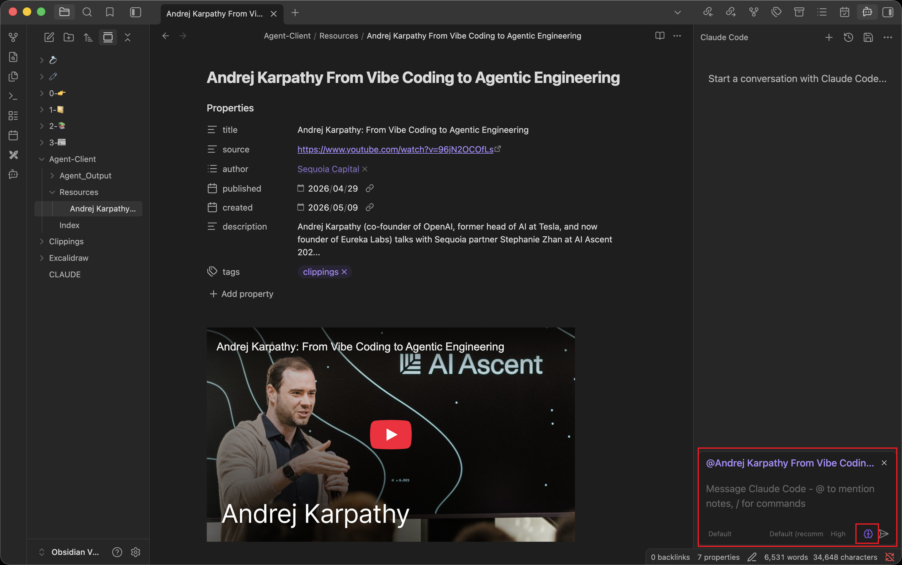
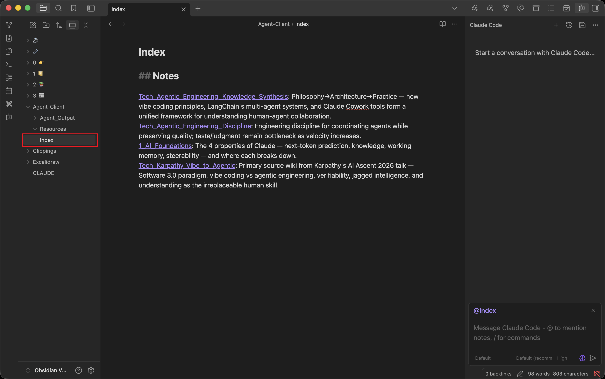
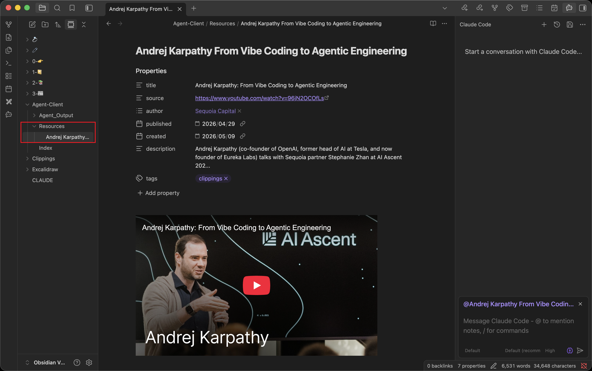

# Wiki Mode

### Start wiki-mode

Click the **Brain** button at the bottom to activate wiki mode.

  

### Share notes with the agent

Add links to shared notes for the agent in `/Agent-client/index.md`, using the `[[Note]]` along with a summary to help the agent better determine when to use them.

  

::: tip
You can toggle the switch in `Settings -> Agent Workspace -> Agent-assisted index updates` so that the agent will assist you in maintaining `Index.md`.
:::

### Share resources with the agent

Add resources to be shared with the Agent under `/Agent-Client/Resources/`, including `*.pdf`, `*.mp3`, `*.xls`, ... (as long as your Claude Code can read them).

::: tip
You can modify your agent workspace location in `Settings -> Agent Workspace -> Workspace folder`.
:::

  

---

::: tip
For a better experience, you can configure personal preferences in `CLAUDE.md` (Vault root directory).

e.g.

- Cross-reference related concepts using the established double-link protocol to maintain a cohesive knowledge graph.
- Prioritize the use of existing `[[ ]]` notes as the foundation for new content.
- ...
